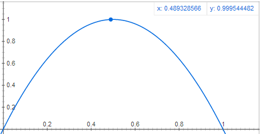
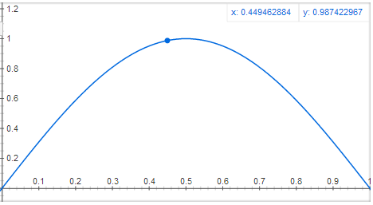
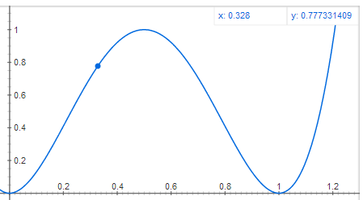
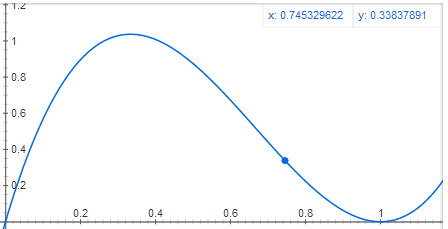
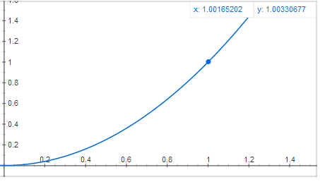
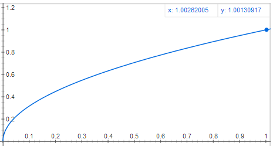
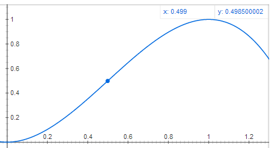
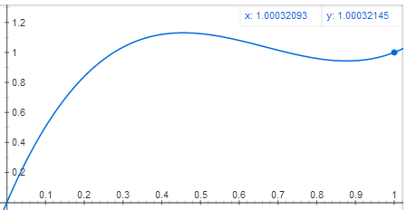

# Useful basis functions
This is an in-progress list of interesting basis functions, functions that map from the interval [0,1] to an interval in the general vicinity of [0,1], and which can be useful for many effects and transitions.

Thanks to Tom Forsyth and Jim Scott for ideas. Please feel free to tweet more suggestions to [@TheJare](https://twitter.com/TheJare).

## Humps
These start and end at zero, and generally reach around 1 at some point in the interval.

[y = x * (1-x) * 4](https://www.google.com/search?q=y%3Dx*(1-x)*4+from+-0.2+to+1.3)

[y = sin(x*pi)](https://www.google.com/search?q=y%3Dsin(x*pi)+from+-0.2+to+1.3)

<a href="https://www.google.com/search?q=y%3Dx*x*(1-x)*(1-x)*16+from+-0.2+to+1.3">
y = x*x*(1-x)*(1-x)*16

<a href="https://www.google.com/search?q=y%3D-7*x*(1-x)*(x-1)+from+-0.2+to+1.3">
y = -7 * x*(1-x)*(x-1)

Transitions [-]

These start at zero and end at one, but with a more interesting trajectory than just linear.

Raising the right side to a power &gt; 1 will push the curve towards the right, &lt; 1 towards the left.

<a href="https://www.google.com/search?q=y%3Dx*x+from+-0.2+to+1.3">
y = x * x

</a>
<a href="https://www.google.com/search?q=y%3Dsqrt(x)+from+-0.2+to+1.3">
y = sqrt(x)

</a>
<a href="https://www.google.com/search?q=y%3D-2*x*x*x+%2B+3*x*x+from+-0.2+to+1.3">
y = -2*x*x*x + 3*x*x

</a>
<a href="https://www.google.com/search?q=y%3D-5*x*(1-x)*(x-1)%2Bx+from+-0.2+to+1.3">
y = -5 * x*(1-x)*(x-1) + x

</a>

